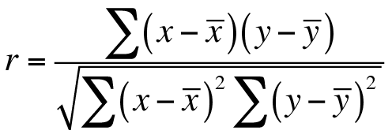
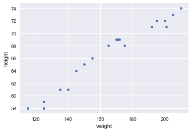

# Covariance and Correlation

## SWBAT

* Understand and calculate covariance between given variables
* Understand and calculate correlation between variables
* Interpret the results of pearson correlation coefficient  


### Introduction to Covariance 

In probability theory and statistics, covariance is a measure of the degree to which two random variables (X, Y) change together. If the variables tend to show similar behavior, the covariance is positive. 

In the opposite case, when the greater values of one variable mainly correspond to the smaller values of the other, the covariance is negative.

Covariance is calculated as:  


Let's use a simple dataset to explore the idea of covariance and perform covariance calculation. 

### Dataset

The dataset (HeightWeight.csv) includes 20 heights (inches) and weights(pounds). At this point, you should be able to calculate the average height and average weight. You can also explain the medians, variances and standard deviations for this dataset. 

But all of those measurements are only concerned with a **single** variable. What if we want to see **how height interacts with weight?** Does weight increase as height increases?

Note while there are plenty of fat short people and overly skinny tall people, when you look at the population at large, taller people will tend to weigh more than shorter people. This generalization of information is very common as it shows you a bigger picture that you can build your intuitions upon. 

Let's try to calculate covariance using formula shown above.


```python
# import the necessary libraries
import pandas as pd
import numpy as np
import math
```


```python
# Read the dataset HeightWeight.csv into a pandas dataframe

data = pd.read_csv('HeightWeight.csv', 
                   header = None)

# Assign column names to data set
data.columns = ['height','weight']

# View a fragmant of resulting dataset
data.head()

#   height- weight
# 0	68  	165
# 1	71  	201
# 2	61  	140
# 3	69  	170
# 4	71  	192
```


<div>
<style scoped>
    .dataframe tbody tr th:only-of-type {
        vertical-align: middle;
    }

    .dataframe tbody tr th {
        vertical-align: top;
    }

    .dataframe thead th {
        text-align: right;
    }
</style>
<table border="1" class="dataframe">
  <thead>
    <tr style="text-align: right;">
      <th></th>
      <th>height</th>
      <th>weight</th>
    </tr>
  </thead>
  <tbody>
    <tr>
      <th>0</th>
      <td>68</td>
      <td>165</td>
    </tr>
    <tr>
      <th>1</th>
      <td>71</td>
      <td>201</td>
    </tr>
    <tr>
      <th>2</th>
      <td>61</td>
      <td>140</td>
    </tr>
    <tr>
      <th>3</th>
      <td>69</td>
      <td>170</td>
    </tr>
    <tr>
      <th>4</th>
      <td>71</td>
      <td>192</td>
    </tr>
  </tbody>
</table>
</div>


### Using Pandas `pd.cov()` function

We can verify out results by using Pandas buikt in function `pd.cov()`, that resturns a covariance matrix showing the covariance between all columns of a dataframe. 


```python
# Use .cov function with data to calculate covariance
data.cov()
```


<div>
<style scoped>
    .dataframe tbody tr th:only-of-type {
        vertical-align: middle;
    }

    .dataframe tbody tr th {
        vertical-align: top;
    }

    .dataframe thead th {
        text-align: right;
    }
</style>
<table border="1" class="dataframe">
  <thead>
    <tr style="text-align: right;">
      <th></th>
      <th>height</th>
      <th>weight</th>
    </tr>
  </thead>
  <tbody>
    <tr>
      <th>height</th>
      <td>26.134211</td>
      <td>144.757895</td>
    </tr>
    <tr>
      <th>weight</th>
      <td>144.757895</td>
      <td>839.326316</td>
    </tr>
  </tbody>
</table>
</div>


Let's now move to correlation and calculate it just like above. 

## Pearson Correlation (r)

So we have another measurement known as correlation. A very basic correlation equation divides out the standard deviation of both height and weight. The result of a correlation is between 1 and -1. With -1 being perfect anti-correlation and 1 being perfect correlation. 0 mean no correlation exists.



Let's use pandas `pd.corr()`  and/or numpy's `np.corrcoef()` function to verify our result


```python
# Use .corr() function to calculate correlation between data columns
data.corr()
```


<div>
<style scoped>
    .dataframe tbody tr th:only-of-type {
        vertical-align: middle;
    }

    .dataframe tbody tr th {
        vertical-align: top;
    }

    .dataframe thead th {
        text-align: right;
    }
</style>
<table border="1" class="dataframe">
  <thead>
    <tr style="text-align: right;">
      <th></th>
      <th>height</th>
      <th>weight</th>
    </tr>
  </thead>
  <tbody>
    <tr>
      <th>height</th>
      <td>1.0000</td>
      <td>0.9774</td>
    </tr>
    <tr>
      <th>weight</th>
      <td>0.9774</td>
      <td>1.0000</td>
    </tr>
  </tbody>
</table>
</div>


```python
# use np.corrcoef(x,y) to confirm your answer above
np.corrcoef(data.weight, data.height)
```


    array([[1.        , 0.97739957],
           [0.97739957, 1.        ]])


Brilliant. Our results have been verified and this also indicates that with an increase in height, the weight of an individual increases accordingly. We can visualize the data columns to confirm our intuition. 


```python
# Plot weight and height as scatter plots 
data.plot.scatter(x = 'weight', y = 'height')
```


    <matplotlib.axes._subplots.AxesSubplot at 0x114e0f7b8>





The graph above confirms our findings as we can see a liear relationship between weights and heights i.e. weight increases with increasing height and vice versa. 

## Summary 

This lab explains the calculations for covariance and correlation and how to interpret the values for both of these. We learnt to measure and represent how strongly two random variables as correlation. Covariance is nothing but a measure of correlation. On the contrary, correlation refers to the scaled form of covariance.

>Correlation is dimensionless, i.e. it is a unit-free measure of the relationship between variables. Covariance is a measure of correlation. 
